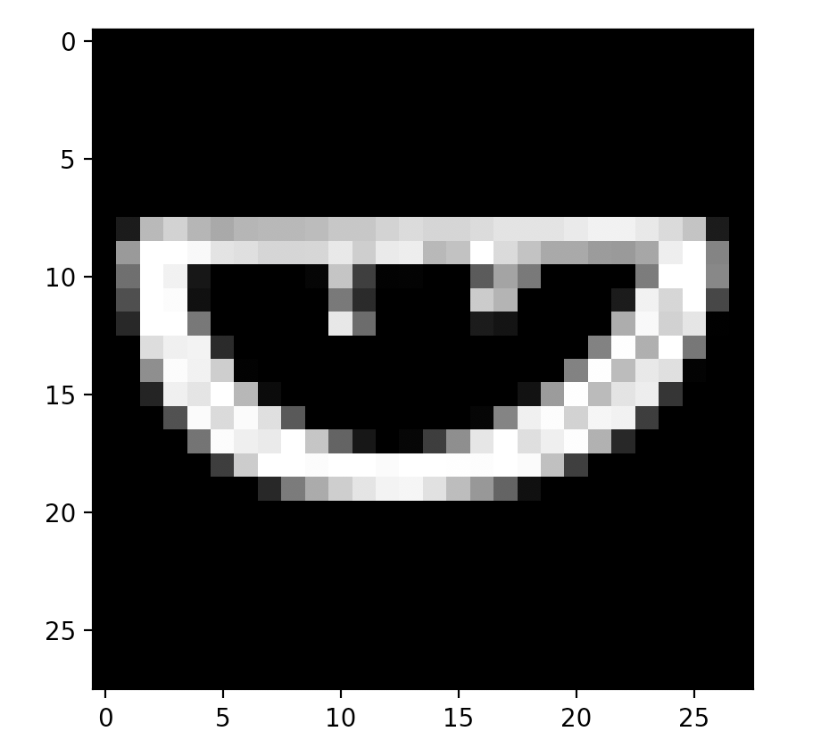
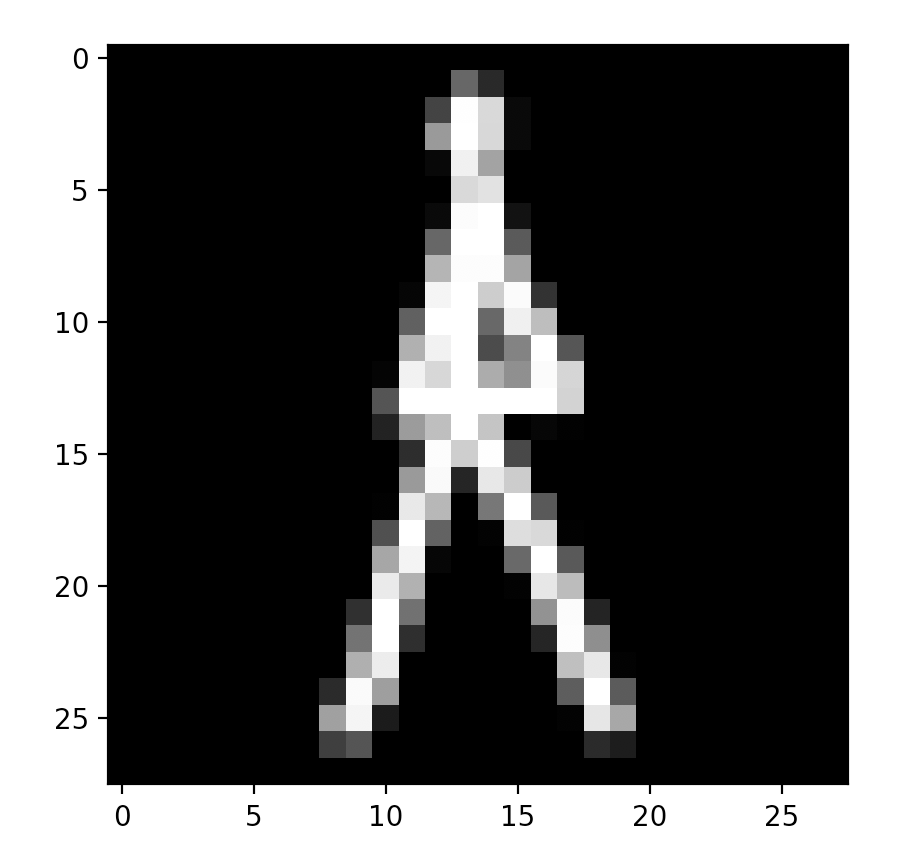
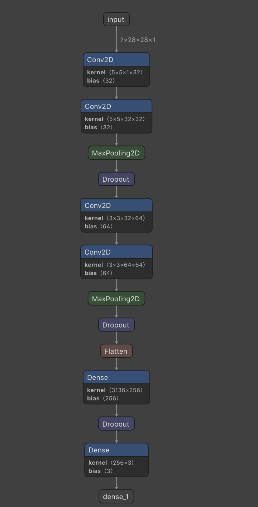
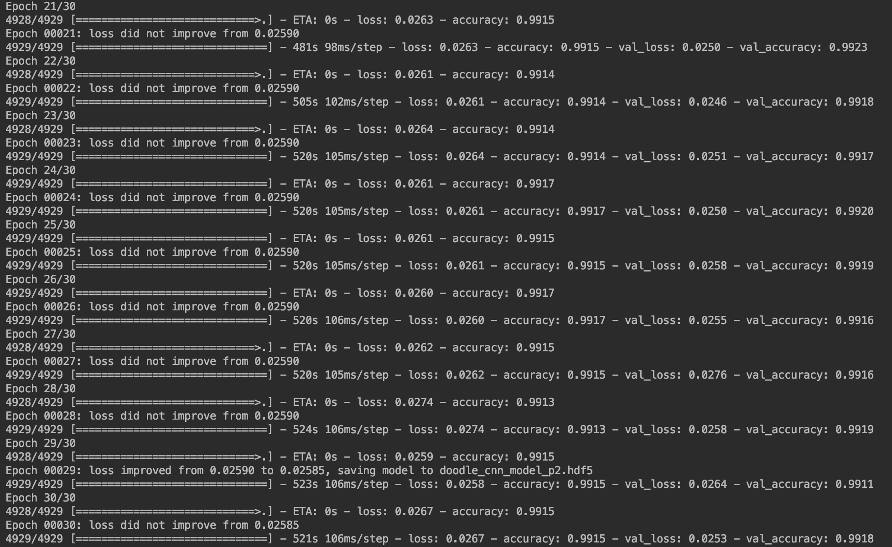
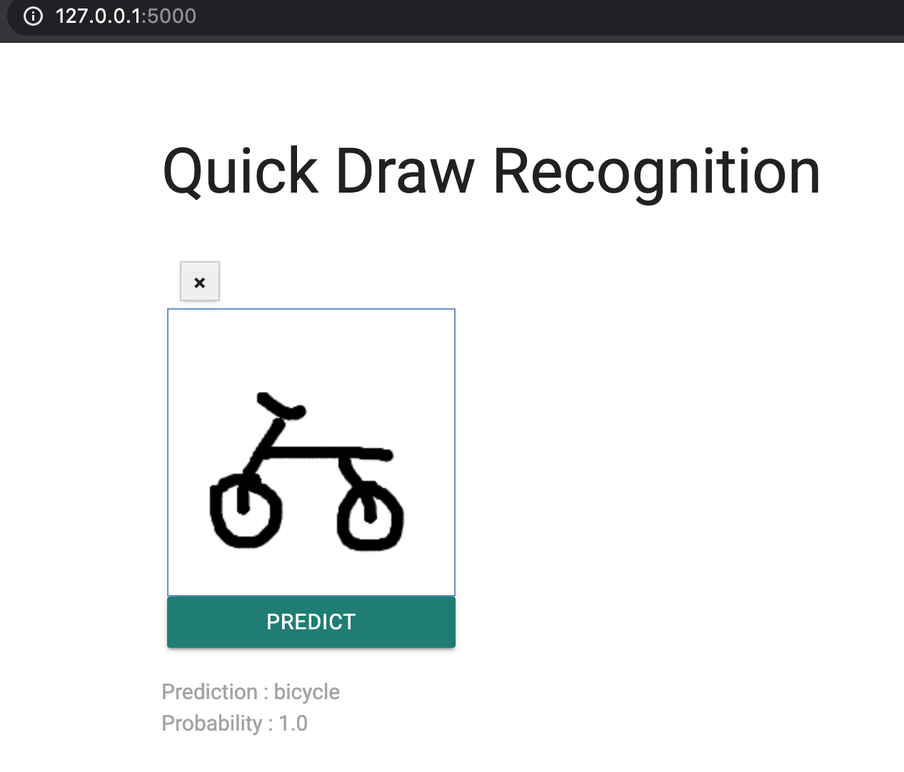

Quick Draw Recognition
--

## Introduction
In 2016, Google released an online game titled “Quick, Draw!” — an AI experiment that has educated the public on neural networks and built an enormous dataset of over a billion drawings.

Applications:

1. Invent new games /business ideas

2. Improving handwriting recognition

In this project, will train some categories of Google public dataset to make Quick Draw Recognition web app. 

## TEFPA

1. Task: Classify draw image to correspond category.

2. Experience: Label image as correspond category.

3. Function Space: ...

4. Performance: Cross Entropy Loss.

5. Algorithm: CNN.


## Installation 

Install 

```pip install -r requirements.txt```

Run app server

```python app.py```


## Data

Source: https://quickdraw.withgoogle.com/data/



Class: ```Watermelon```



Class: ```Effel Tower```


## Model

Keras Sequential API.
Structures:

1. Convolutional (Conv2D) layer. 
- It is like a set of learnable filters: 
- 32 filters for the two firsts conv2D layers 
- 64 filters for the two last ones.

2. Pooling (MaxPool2D) layer: 
- acts as a downsampling filter.
- picks the maximal value 2 neighboring pixels. 
- reduce computational cost
- reduce overfitting. 
- more the pooling dimension is high, more the downsampling is important.

3. Dropout: 
- randomly ignored for each training sample. 
- drops randomly a propotion of the network 
- forces the network to learn features in a distributed way.

4. Relu: 
- the rectifier
- used to add non linearity to the network.

5. Flatten layer: 
- convert the final feature maps into a one single 1D vector. 

6. Last two fully-connected (Dense) layers:
- artificial an neural networks (ANN) classifier. 
- In the last layer outputs distribution of probability of each class.




## Summary Table
|      | |
| ---------- |-------------------|
| **Author**       | Le Hung Son|
| **Title**        | Quick Draw Recognition |
| **Topics**       | Ứng dụng trong computer vision, làm game, sử dụng thuật toán chính là CNN|
| **Descriptions** | Input là danh sách các numpy array được lưu trong file ```*.npy```, tên file chính là tên object tương ứng. Khi train xong sẽ trả ra output là file trọng số ```doodle_cnn_model.hdf5```. Ta sẽ sử dụng trọng số này đã train để predict.|
| **Links**        | https://github.com/sonlh07/final-vtc-quick-draw |
| **Framework**    | Tensorflow|
| **Pretrained Models**  | |
| **Datasets**     |Mô hình được train với bộ dữ liệu https://github.com/googlecreativelab/quickdraw-dataset|
| **Level of difficulty**|Sử dụng nhanh và dễ, có thể train lại với tập dữ liệu khác tốc độ tùy thuộc vào phần cứng và hình ảnh input|


## Training & validation

Train the model:

```cd src```

```python train.py```

All trained weights will saved to:

```saved/*.hdf5```




## Demo

1. Draw an object on the right board
2. Click the Predict button
3. Results will be showed
(You can repeat these steps with the clear button)



## References
1. https://github.com/googlecreativelab/quickdraw-dataset#get-the-data
2. https://qz.com/994486/the-way-you-draw-circles-says-a-lot-about-you/
3. https://github.com/lutzroeder/netron
4. https://quickdraw.withgoogle.com/data/watermelon
5. https://github.com/gary30404/convolutional-neural-network-from-scratch-python/
